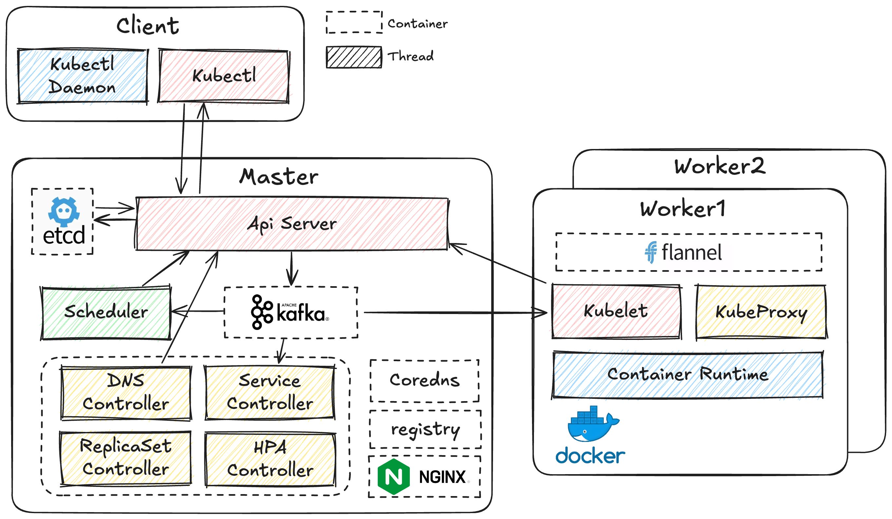

# Minik8s

>  2025年《SE3356 云操作系统设计与实践》课程第四小组项目，简易的[Kubernetes](https://kubernetes.io/zh-cn/)容器编排工具，通过python语言实现。

## Introduction



## Get Started

```bash
conda create -n k8s python=3.12
pip install -r requirements.txt
```